<div align="center">

# 🚀 LGUIBR

### The Ultimate GitHub README Generator

[](https://www.typescriptlang.org/)
[](https://vitest.dev/)
[](./LICENSE)
[](./CONTRIBUTING.md)

</div>

---

## 📖 Overview

**LGUIBR** is a sophisticated CLI tool designed to automatically generate high-fidelity, "State-of-the-Art" (SOTA) READMEs for your GitHub profile. It intelligently analyzes your repositories, detects technology stacks (Node.js, Python, Go, etc.), and renders a beautiful, structured table of your projects.

### ✨ Key Features

- **🧠 Smart Analysis**: Automatically detects frameworks (React, Next.js, NestJS), languages, and internal dependencies.
- **🎨 Rich Badges**: Generates Shields.io badges for every tech stack component.
- **📊 Categorization**: Groups repositories into logical categories like "Frontend", "Backend", "AI", and "Libraries".
- **🖥️ Interactive CLI**: A beautiful terminal interface powered by `inquirer` and ASCII art.
- **🛡️ Type-Safe**: Built with 100% strict TypeScript.

## 🚀 Quick Start

### Installation

```bash
git clone https://github.com/lguibr/lguibr.git
cd lguibr
npm install
```

### Usage

```bash
# Build the project
npm run build

# Run the CLI
npm start
```

## 🏗️ Architecture

The project is structured as a modular monolith, with distinct layers for API interaction, core logic, and presentation.

```mermaid
graph TD
    CLI[🖥️ CLI] -->|Invokes| Core[🧠 Core Logic]
    Core -->|Fetches| API[☁️ GitHub API]
    Core -->|Generates| Gen[🎨 Generators]
    Gen -->|Outputs| MD[📝 README.md]
```



👉 **[Explore the Source Code](./src/README.md)** for a deep dive into the architecture.

## 🤝 Contributing

We welcome contributions! Please see [CONTRIBUTING.md](./CONTRIBUTING.md) for details on how to get started.

## 📄 License

This project is licensed under the [MIT License](./LICENSE).
