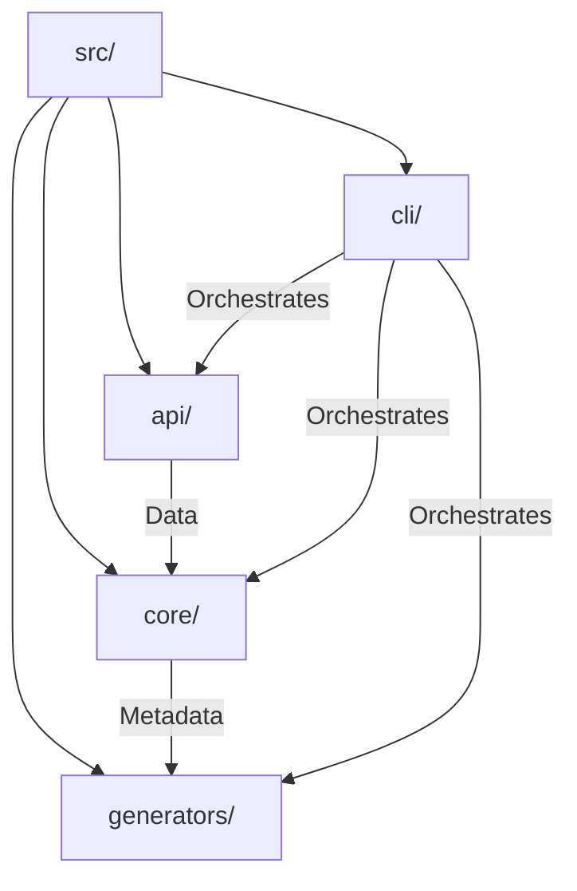

# 📂 Source Code Structure

> **LGUIBR Core Architecture**

Welcome to the source code of **LGUIBR**. This project follows a modular, domain-driven architecture to ensure scalability, maintainability, and testability.

## 🗺️ Module Map

## 📚 Modules

| Module | Description | Documentation |
|--------|-------------|---------------|
| **[api](./api)** | **Networking Layer**: Handles all GitHub API interactions with resilience and type safety. | [Read More](./api/README.md) |
| **[core](./core)** | **Business Logic**: Intelligent extraction, analysis, and categorization of repository data. | [Read More](./core/README.md) |
| **[generators](./generators)** | **Presentation Layer**: Renders the final HTML/Markdown and generates dynamic badges. | [Read More](./generators/README.md) |
| **[cli](./cli)** | **User Interface**: The interactive terminal application that ties everything together. | [Read More](./cli/README.md) |

## 🛠️ Tech Stack

- **TypeScript**: 100% strict typing for reliability.
- **Vitest**: Blazing fast unit testing with high coverage.
- **Inquirer.js**: Interactive command-line user interfaces.
- **Octokit**: Official GitHub API client.
