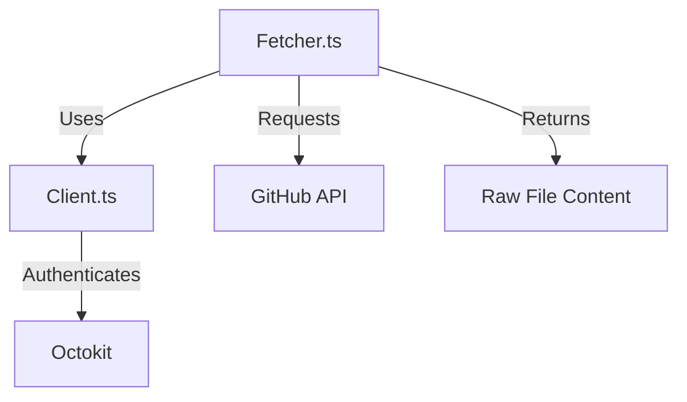

# 📡 API Module

> **State-of-the-Art GitHub API Interaction Layer**

This module handles all external communication with the GitHub API, providing a type-safe and resilient interface for fetching repository data.

## 🏗️ Architecture



## 📦 Components

| File                         | Description                                                                                                              |
| ---------------------------- | ------------------------------------------------------------------------------------------------------------------------ |
| [`client.ts`](./client.ts)   | **Authentication**: Initializes Octokit with `GITHUB_TOKEN`. Handles rate limiting and environment configuration.        |
| [`fetcher.ts`](./fetcher.ts) | **Data Retrieval**: Fetches raw file content (READMEs, `package.json`, etc.) with robust error handling and null safety. |
| [`types.ts`](./types.ts)     | **Type Definitions**: Exports strict TypeScript interfaces for GitHub API responses (`GithubRepo`, `GithubUser`).        |

## 🔧 Usage

```typescript
import { fetchRemoteFile } from './fetcher.js';

const content = await fetchRemoteFile('owner', 'repo', 'README.md');
if (content) {
  console.log('README found!');
}
```
