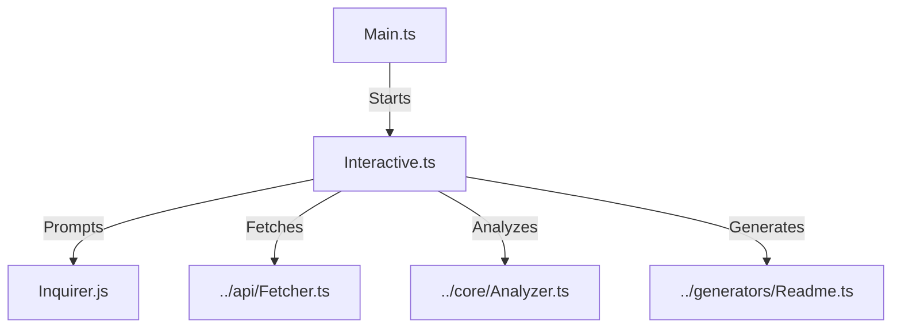

# 💻 CLI Module

> **Interactive Command Line Interface**

This module powers the terminal user experience, handling user input, repository selection, and the main execution flow.

## 🏗️ Architecture



## 📦 Components

| File | Description |
|------|-------------|
| [`main.ts`](./main.ts) | **Entry Point**: The executable script. Initializes the CLI, displays the ASCII art banner, and triggers the interactive flow. |
| [`interactive.ts`](./interactive.ts) | **User Interaction**: Manages the prompt loop using `inquirer`. Handles username input, repository selection (checklist), and manual descriptions. |

## 🔧 Usage

```bash
# Run the CLI directly
npm start

# Or import specific prompts
import { promptUsername } from './interactive.js';
const user = await promptUsername();
```
