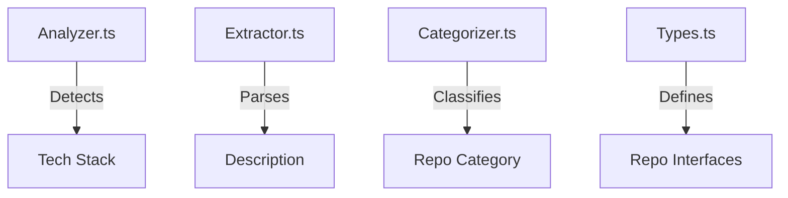

# 🧠 Core Logic Module

> **The Brain of the README Generator**

This module contains the domain logic for analyzing, categorizing, and processing repository data. It transforms raw API responses into rich, structured metadata.

## 🏗️ Architecture



## 📦 Components

| File                                 | Description                                                                                                                                |
| ------------------------------------ | ------------------------------------------------------------------------------------------------------------------------------------------ |
| [`analyzer.ts`](./analyzer.ts)       | **Stack Detection**: Analyzes `package.json`, `go.mod`, and `pyproject.toml` to identify frameworks, languages, and internal dependencies. |
| [`categorizer.ts`](./categorizer.ts) | **Classification**: Assigns repositories to high-level categories (e.g., "AI & Python", "Frontend") based on their tech stack.             |
| [`extractor.ts`](./extractor.ts)     | **Content Extraction**: Intelligently parses remote READMEs to extract meaningful descriptions, ignoring badges and headers.               |
| [`types.ts`](./types.ts)             | **Domain Models**: Defines the `EnhancedRepo` and `RepoStack` interfaces used throughout the application.                                  |

## 🔧 Usage

```typescript
import { detectStackFromRemote } from './analyzer.js';

const stack = await detectStackFromRemote(repo, ['my-other-repo']);
console.log(stack.frameworks); // ['React', 'Next.js']
```
