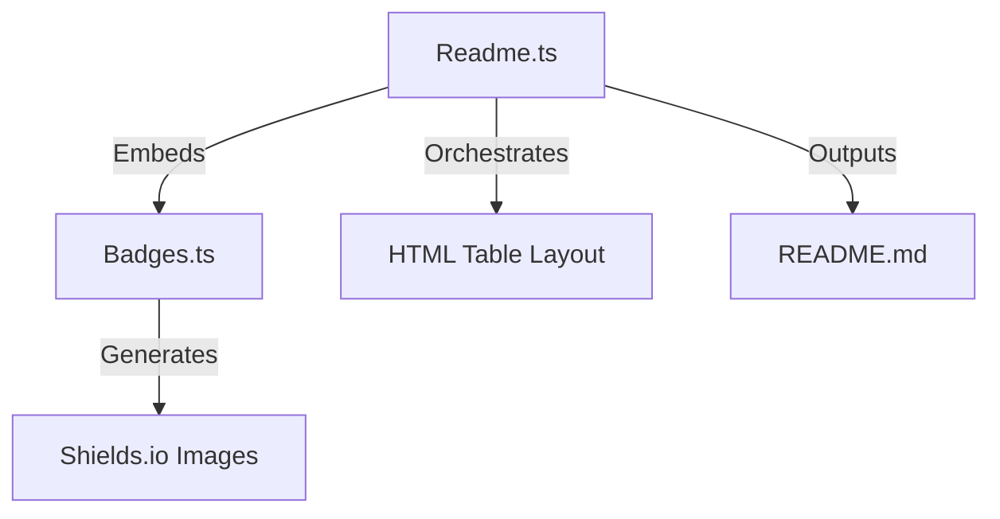

# 🎨 Generators Module

> **HTML & Markdown Generation Engines**

This module is responsible for rendering the final visual output. It transforms structured repository data into beautiful, GitHub-flavored Markdown and HTML.

## 🏗️ Architecture



## 📦 Components

| File | Description |
|------|-------------|
| [`badges.ts`](./badges.ts) | **Badge Engine**: Generates Shields.io badges for stars, languages, frameworks (React, Go, etc.), and **Cocov** coverage. |
| [`readme.ts`](./readme.ts) | **Layout Engine**: Renders the "Product Landing" style table layout, grouping repositories by category and injecting descriptions/tags. |

## 🔧 Usage

```typescript
import { generateHTML } from './readme.js';

const html = generateHTML(enhancedRepos);
console.log(html); // Outputs the full <table ...> string
```
